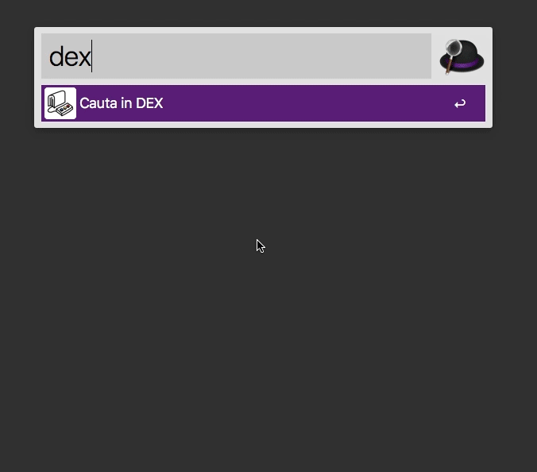

# alfred-dexonline
Alfred workflow for searching Romanian words definitions in [dexonline.ro](https://dexonline.ro) dictionary.
Dexonline.ro is a well-known Romanian online dictionary. Words definitions are permanently updated and maintained by contributors. 

[Download the latest version](https://github.com/andrei-popa/alfred-dexonline/releases/tag/v1.0.2), for Alfred v3 and macOS

This Alfred workflow makes it easy to search Romanian words and instantly find their definition or synonyms.

alfred-dexonline uses [alfy](https://github.com/sindresorhus/alfy) and dexonline.ro API. 

Git clone and install with: `npm install`

